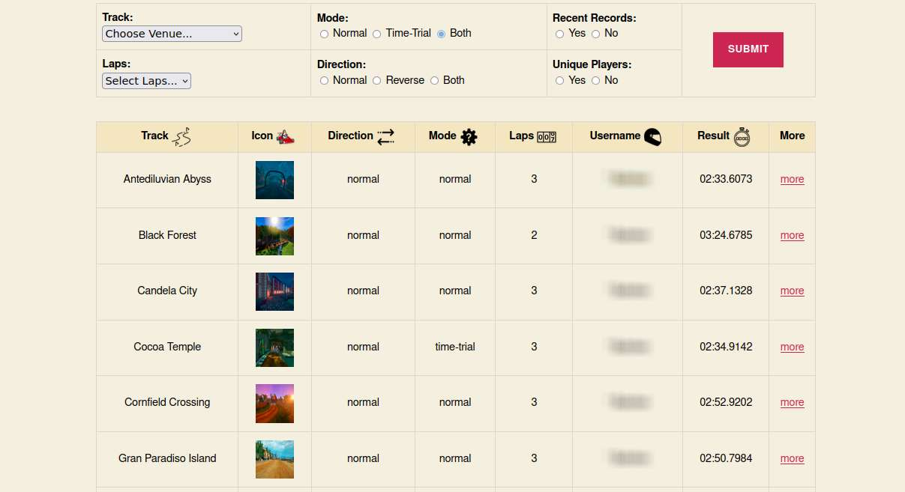

<h1 align="center">SuperTuxKart Highscore Table</h1>

If you're running a SuperTuxKart server with activated sqlite3 database, you may want to inspect, review, present or publish your player's records.
The server you are running has to be compiled and configured accordingly. Alternatively, you can use a ready-to-run docker image, which is offered by various users (e.g. @iluvatyr). The database configuration would nevertheless be required, however.

This repository offers a lightweight website using HTML and PHP presenting your server's racing results, which can be filtered by different aspects.
Therefore you also need webspace or a webserver running PHP with sqlite3 support. I tested PHP 7.4 and 8.2. Other releases may or may not be compatible. Simply copy all files to your webserver and access the index.php.

Since I don't care much about design issues, I used the website of @iluvatyr as an inspiration (https://stk.iluvatyr.com/records). I partly adopted his/her design. Thankx to him/her for serving as template.

It is obviously important that the script knows the path to your sqlite3 database (usually named stkservers.db). The path has to be configured at the beginning of index.php. Please make sure that your webserver has sufficient access rights to read your database.

The tracks.php lists all race tracks as an array, including their STK-ID (which is the track's folder name), human readable title and the default number of laps. It would be possible to gather this information from the various track.xml files in the assets/addons folder of your STK installation. I decided against this solution since it would require even more access rights and significantly impair performance depending on the number of tracks installed.

On Github the array only contains the default tracks included in STK 1.4; add-on tracks or additional individual tracks can easily be added as required. The corresponding track icons (dropped in /media/tracks and named according their STK-ID) can generated (resized) from the screenshots inside the individual track's folder (or simply copied from iluvatyrs website).
